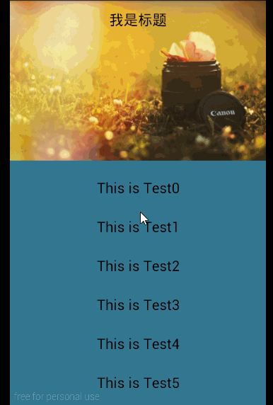

##本项目实现标题栏背景随着页面滚动而变化颜色
实现效果图

原理：
监听ScrollView的滚动事件

	 @Override
	    protected void onScrollChanged(int x, int y, int oldx, int oldy) {
	        super.onScrollChanged(x, y, oldx, oldy);
	        if(mScrollViewListener!=null){
	            mScrollViewListener.onScrollChanged(x, y, oldx, oldy);
	        }
	    }

动态获得图片的高片

	 ViewTreeObserver viewTreeObserver = image.getViewTreeObserver();
	        viewTreeObserver.addOnGlobalLayoutListener(new ViewTreeObserver.OnGlobalLayoutListener() {
	            @Override
	            public void onGlobalLayout() {
	                image.getViewTreeObserver()
	                     .removeGlobalOnLayoutListener(this);
	
	                height = image.getHeight();
	                Log.e(TAG, "height:" + height);
	                obserView.setScrollViewListener(MainActivity.this);
	            }
	        });

动态改变标题的背景色

	 @Override
	    public void onScrollChanged(int x, int y, int oldx, int oldy) {
	        if (y <= 0) {
	            Log.e(TAG, "Top");
	            tvTitle.setBackgroundColor(Color.argb((int) 0, 227, 29, 26));//AGB由相关工具获得，或
	        } else if (y > 0 && y < height) {
	            Log.e(TAG, "middle");
	            float scale = (float) y / height;
	            float alpha = (255 * scale);
	            Log.e(TAG, "alpha:" + alpha);
	            // 只是layout背景透明(仿知乎滑动效果)
	            tvTitle.setBackgroundColor(Color.argb((int) alpha, 227, 29, 26));
	        } else {
	            Log.e(TAG, "Bottom");
	            tvTitle.setBackgroundColor(Color.argb((int) 255, 227, 29, 26));
	        }
	    }